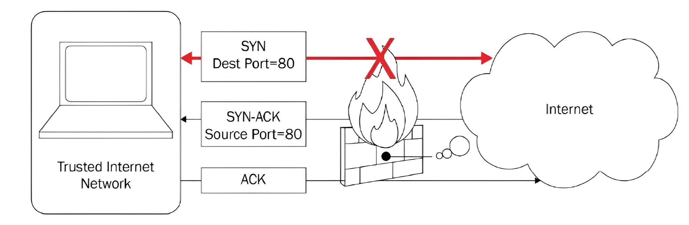

# 🧐 **Appreciating Traffic Analysis**

Today's networks are incredibly complex. Often, when problems arise, the only path to a solution is to **see the problem** directly. For this exact reason, **packet analysis**—using tools like **Wireshark**—has been a fundamental practice for many years.

Beyond manual packet analysis with Wireshark, modern devices now integrate the capability to pull data from the network and examine its contents. This function empowers network administrators to effectively **troubleshoot, test, baseline, and monitor** the network for potential threats.

This chapter will guide you through the many benefits of using Wireshark for packet analysis. You will learn about its history as an exceptional open-source software product, which includes many rich features. You will also discover how various groups can benefit from using packet analysis, such as:

* Network Administrators
* Students
* Security Analysts

In addition, we will cover the many places where packet analysis can be conducted, including on a **Local Area Network (LAN)**, on a **host**, or in the **real world**.

Finally, you will learn how Wireshark possesses the ability to decode hundreds of different protocols and is constantly being improved, making it the optimal tool for monitoring the network.

---

## 🔬 Reviewing Packet Analysis

Packet analysis is the process of examining packets to understand the **characteristics** and **structure** of traffic flow. This can be done either during a live capture or by using a previously captured file. The analyst can complete this analysis by studying one packet at a time or as a complete capture.

When monitoring the network for analysis, we capture traffic using specialized software such as **Wireshark** or **tshark**. Once the data is captured and we save the file, the software stores the data in a file commonly called a **packet capture** or **PCAP file**.

Packet analysis benefits many groups, including the following:

* **Network administrators:** Use packet analysis to gain information about current network conditions.
* **Security analysts:** Use packet analysis to determine whether there is anything unusual or suspicious about the traffic when carrying out a forensic investigation.
* **Students:** Use packet analysis as a learning tool to better understand the workings of different protocols.
* **Hackers:** Use packet analysis to sniff network traffic while conducting footprinting and reconnaissance to gain valuable information about the network.

We use packet analysis in many places, including on a **LAN**, on a **host**, or in the **real world**. Additionally, we use packet analysis when troubleshooting **latency** issues, testing **Internet of Things (IoT)** devices, and as a tool when **baselining** the network.

Today, packet analysis using Wireshark is a valuable skill. However, analyzing packets has been around in the networking world for many years. As early as the 1990s, various tools enabled analysts to carry out packet analysis on the network to troubleshoot errors and to monitor server behavior.

In the next section, we'll examine some of the early tools used to monitor network activity.

---

## 📜 Exploring Early Packet Sniffers

Packet analysis has existed in some form for **over 20 years** as a diagnostic tool to observe data and other information traveling across the network. Packet analysis is also referred to as **sniffing**. This term refers to early packet sniffers, which "sniffed" or captured traffic as it traveled across the network.

In the 1990s, Novell, a software company, developed the **Novell LANalyzer**. This tool had a graphical UI and dashboard to examine network traffic. Concurrently, Microsoft introduced its **Network Monitor**.

Over the last 20 years, there have been many other packet analyzers and tools to sniff traffic, including the following:

| Tool            | Description                                                                                                   |
|-----------------|---------------------------------------------------------------------------------------------------------------|
| Cain and Abel   | This tool can gather passwords and record Voice over Internet Protocol (VoIP) conversations.                 |
| NarusInsight    | Formerly known as Carnivore, this was used to monitor all internet traffic.                                   |
| dSniff          | This passively monitors a network for interesting traffic.                                                    |
| Ettercap        | This eavesdrops to capture passwords, emails, and files.                                                      |
| Tcpdump         | This is a protocol analyzer that runs from the command line.                                                  |
| Security Onion  | This is an open source tool that combines packet capture with an Intrusion Detection System (IDS).           |
| Wireshark       | This is a packet sniffer used to analyze network traffic.                                                     |

<b>Table 1.1 – Packet analyzers and tools</b>

*(Note: The content for Table 1.1 was not provided in the source text.)*

Most packet analyzers work in a similar manner. They capture data and then decode the raw bits in the field values according to the appropriate **Request for Comment (RFC)** or other specifications. Once this is done, the data is presented in a meaningful fashion.

Packet analysis tools range in appearance and functionality, as follows:

* They provide simple **text-based analysis**, such as the terminal-based Wireshark (**tshark**).
* They deliver a rich **graphical UI** with advanced **artificial intelligence (AI)-based expert systems** that guide the analyst through a more targeted evaluation.

---

# 🖥️ **Evaluating Devices That Use Packet Analysis**

Packet analysis and traffic sniffing are utilized by many devices on the network, including routers, switches, and firewall appliances. As data flows across the network, these devices gather and interpret the packet's raw bits. They examine the field values in each packet to decide on what action should be taken.

Devices examine network traffic in the following manner:

* A **router** captures the traffic and examines the **IP header** to determine where to send the traffic, as part of the routing process.
* An **IDS (Intrusion Detection System)** examines the traffic and alerts the network administrator if there is any unusual or suspicious behavior.
* A **firewall** monitors all traffic and will **drop any packets** that are not in line with the **Access Control List (ACL)**.

For example, when data passes through a firewall, the device examines the traffic and determines whether to allow or deny the packets according to the ACL.

## 📜 Using an ACL

When using a firewall, an **ACL (Access Control List)** governs the type of traffic that is allowed on the network.

For example, an ACL has the following entries:

* Allow **outbound SYN** packets. The **destination port is 80**.
* Allow **inbound SYN-ACK** packets. The **source port is 80**.

To decide whether to allow or deny a packet, the firewall must check each header as it passes through the device. It will determine variables such as IP addresses, **Transmission Control Protocol (TCP) flags**, and port numbers that are in use.

If the packet does not meet the ACL entry, the firewall will drop the packet.

  

### 📊 Figure 1.1 – A firewall with an ACL

As shown in the diagram, an inbound **SYN** packet with a **destination port of 80** is blocked because it does not match the rule.

Here is a detailed breakdown of the diagram based on the provided ACL rules:

1.  **Trusted Network (Internal):** The laptop on the "Trusted Internet Network" initiates a connection to a web server (Port 80) on the "Internet."
2.  **Allowed Outbound Traffic:** The first packet is a `SYN` packet with a `Dest Port=80`. This is an **outbound** packet and **matches the first ACL rule**, so the firewall allows it to pass to the Internet.
3.  **Allowed Inbound Traffic:** The Internet server responds with a `SYN-ACK` packet. This packet is **inbound** and has a `Source Port=80`. This **matches the second ACL rule**, so the firewall allows it to pass to the internal laptop.
4.  **Allowed Outbound ACK:** The laptop sends a final `ACK` packet to establish the connection, which is allowed.
5.  **Blocked Inbound Traffic (Highlighted):** The diagram shows a separate, unsolicited **inbound** `SYN` packet coming from the Internet, attempting to reach the trusted network (`Dest Port=80`).
6.  **Why It Is Blocked:** This packet is blocked (indicated by the red "X" and flames) because it **does not match any ACL rule**. The second rule only allows *inbound* packets that are `SYN-ACK` (a reply). This packet is a `SYN` packet (a new connection attempt). Since no rule explicitly allows this unsolicited inbound `SYN` packet, the firewall drops it.

> **It's important to note:** A packet sniffer examines traffic but **doesn't modify the contents** in any way. It simply gathers the traffic for analysis as it travels across the network.

As you can see, packet sniffing and analysis have been influential for many years as elements of managing networks.

---