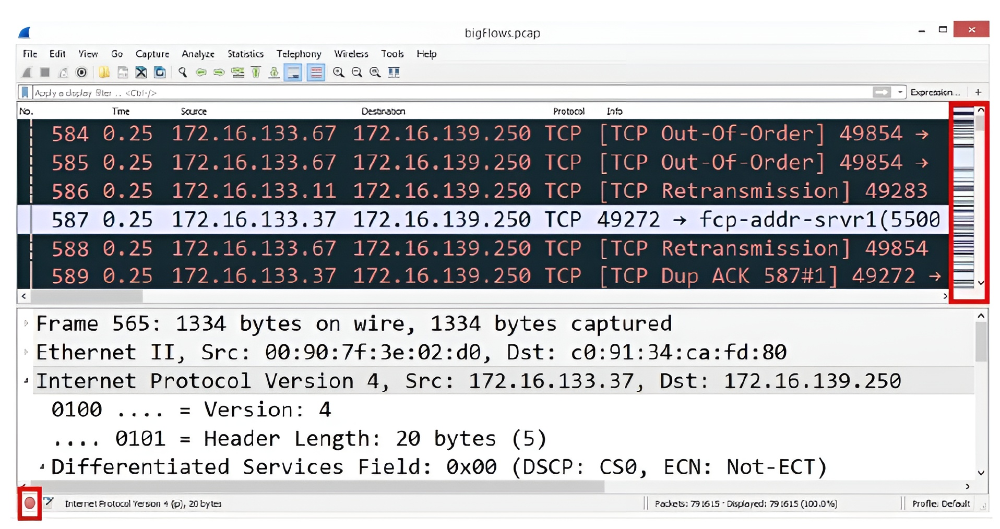

# 🧐 **Appreciating Traffic Analysis**

Today's networks are incredibly complex. Often, when problems arise, the only path to a solution is to **see the problem** directly. For this exact reason, **packet analysis**—using tools like **Wireshark**—has been a fundamental practice for many years.

Beyond manual packet analysis with Wireshark, modern devices now integrate the capability to pull data from the network and examine its contents. This function empowers network administrators to effectively **troubleshoot, test, baseline, and monitor** the network for potential threats.

This chapter will guide you through the many benefits of using Wireshark for packet analysis. You will learn about its history as an exceptional open-source software product, which includes many rich features. You will also discover how various groups can benefit from using packet analysis, such as:

* Network Administrators
* Students
* Security Analysts

In addition, we will cover the many places where packet analysis can be conducted, including on a **Local Area Network (LAN)**, on a **host**, or in the **real world**.

Finally, you will learn how Wireshark possesses the ability to decode hundreds of different protocols and is constantly being improved, making it the optimal tool for monitoring the network.

---

## 🔬 Reviewing Packet Analysis

Packet analysis is the process of examining packets to understand the **characteristics** and **structure** of traffic flow. This can be done either during a live capture or by using a previously captured file. The analyst can complete this analysis by studying one packet at a time or as a complete capture.

When monitoring the network for analysis, we capture traffic using specialized software such as **Wireshark** or **tshark**. Once the data is captured and we save the file, the software stores the data in a file commonly called a **packet capture** or **PCAP file**.

Packet analysis benefits many groups, including the following:

* **Network administrators:** Use packet analysis to gain information about current network conditions.
* **Security analysts:** Use packet analysis to determine whether there is anything unusual or suspicious about the traffic when carrying out a forensic investigation.
* **Students:** Use packet analysis as a learning tool to better understand the workings of different protocols.
* **Hackers:** Use packet analysis to sniff network traffic while conducting footprinting and reconnaissance to gain valuable information about the network.

We use packet analysis in many places, including on a **LAN**, on a **host**, or in the **real world**. Additionally, we use packet analysis when troubleshooting **latency** issues, testing **Internet of Things (IoT)** devices, and as a tool when **baselining** the network.

Today, packet analysis using Wireshark is a valuable skill. However, analyzing packets has been around in the networking world for many years. As early as the 1990s, various tools enabled analysts to carry out packet analysis on the network to troubleshoot errors and to monitor server behavior.

In the next section, we'll examine some of the early tools used to monitor network activity.

---

## 📜 Exploring Early Packet Sniffers

Packet analysis has existed in some form for **over 20 years** as a diagnostic tool to observe data and other information traveling across the network. Packet analysis is also referred to as **sniffing**. This term refers to early packet sniffers, which "sniffed" or captured traffic as it traveled across the network.

In the 1990s, Novell, a software company, developed the **Novell LANalyzer**. This tool had a graphical UI and dashboard to examine network traffic. Concurrently, Microsoft introduced its **Network Monitor**.

Over the last 20 years, there have been many other packet analyzers and tools to sniff traffic, including the following:


| Tool            | Description                                                                                                   |
|-----------------|---------------------------------------------------------------------------------------------------------------|
| Cain and Abel   | This tool can gather passwords and record Voice over Internet Protocol (VoIP) conversations.                 |
| NarusInsight    | Formerly known as Carnivore, this was used to monitor all internet traffic.                                   |
| dSniff          | This passively monitors a network for interesting traffic.                                                    |
| Ettercap        | This eavesdrops to capture passwords, emails, and files.                                                      |
| Tcpdump         | This is a protocol analyzer that runs from the command line.                                                  |
| Security Onion  | This is an open source tool that combines packet capture with an Intrusion Detection System (IDS).           |
| Wireshark       | This is a packet sniffer used to analyze network traffic.                                                     |


<p align="center">
<b>Table 1.1 – Packet analyzers and tools</b>
</p>

*(Note: The content for Table 1.1 was not provided in the source text.)*

Most packet analyzers work in a similar manner. They capture data and then decode the raw bits in the field values according to the appropriate **Request for Comment (RFC)** or other specifications. Once this is done, the data is presented in a meaningful fashion.

Packet analysis tools range in appearance and functionality, as follows:

* They provide simple **text-based analysis**, such as the terminal-based Wireshark (**tshark**).
* They deliver a rich **graphical UI** with advanced **artificial intelligence (AI)-based expert systems** that guide the analyst through a more targeted evaluation.

---

# 🖥️ **Evaluating Devices That Use Packet Analysis**

Packet analysis and traffic sniffing are utilized by many devices on the network, including routers, switches, and firewall appliances. As data flows across the network, these devices gather and interpret the packet's raw bits. They examine the field values in each packet to decide on what action should be taken.

Devices examine network traffic in the following manner:

* A **router** captures the traffic and examines the **IP header** to determine where to send the traffic, as part of the routing process.
* An **IDS (Intrusion Detection System)** examines the traffic and alerts the network administrator if there is any unusual or suspicious behavior.
* A **firewall** monitors all traffic and will **drop any packets** that are not in line with the **Access Control List (ACL)**.

For example, when data passes through a firewall, the device examines the traffic and determines whether to allow or deny the packets according to the ACL.

## 📜 Using an ACL

When using a firewall, an **ACL (Access Control List)** governs the type of traffic that is allowed on the network.

For example, an ACL has the following entries:

* Allow **outbound SYN** packets. The **destination port is 80**.
* Allow **inbound SYN-ACK** packets. The **source port is 80**.

To decide whether to allow or deny a packet, the firewall must check each header as it passes through the device. It will determine variables such as IP addresses, **Transmission Control Protocol (TCP) flags**, and port numbers that are in use.

If the packet does not meet the ACL entry, the firewall will drop the packet.

<div align="center">
  
</div>

### 📊 Figure 1.1 – A firewall with an ACL


As shown in the diagram, an inbound **SYN** packet with a **destination port of 80** is blocked because it does not match the rule.

Here is a detailed breakdown of the diagram based on the provided ACL rules:

1.  **Trusted Network (Internal):** The laptop on the "Trusted Internet Network" initiates a connection to a web server (Port 80) on the "Internet."
2.  **Allowed Outbound Traffic:** The first packet is a `SYN` packet with a `Dest Port=80`. This is an **outbound** packet and **matches the first ACL rule**, so the firewall allows it to pass to the Internet.
3.  **Allowed Inbound Traffic:** The Internet server responds with a `SYN-ACK` packet. This packet is **inbound** and has a `Source Port=80`. This **matches the second ACL rule**, so the firewall allows it to pass to the internal laptop.
4.  **Allowed Outbound ACK:** The laptop sends a final `ACK` packet to establish the connection, which is allowed.
5.  **Blocked Inbound Traffic (Highlighted):** The diagram shows a separate, unsolicited **inbound** `SYN` packet coming from the Internet, attempting to reach the trusted network (`Dest Port=80`).
6.  **Why It Is Blocked:** This packet is blocked (indicated by the red "X" and flames) because it **does not match any ACL rule**. The second rule only allows *inbound* packets that are `SYN-ACK` (a reply). This packet is a `SYN` packet (a new connection attempt). Since no rule explicitly allows this unsolicited inbound `SYN` packet, the firewall drops it.


> **It's important to note:** A packet sniffer examines traffic but **doesn't modify the contents** in any way. It simply gathers the traffic for analysis as it travels across the network.

As you can see, packet sniffing and analysis have been influential for many years as elements of managing networks.


---

# 📡 **Capturing Network Traffic**

On today's networks, a **Network Interface Card (NIC)** will **only** monitor traffic that is addressed to **that** host. However, we can put the card into a state called **promiscuous mode**, which will allow the adapter to gather all the traffic that is on the network. Therefore, to capture and monitor all network traffic, the NIC must be in promiscuous mode.

On a Windows machine, you can check to see whether the interface card is in promiscuous mode by running the following command in PowerShell:

```powershell
Windows PowerShell
Copyright (C) 2014 Microsoft Corporation. All rights reserved.
PS C:\Users\Admin> Get-NetAdapter | Format-List -Property PromiscuousMode

PromiscuousMode : False
```

### Code Explanation

  * **`Get-NetAdapter`**: This is a PowerShell cmdlet that retrieves the basic properties of all network adapters on the system.
  * **`|` (Pipe)**: This symbol takes the output from the command on its left (`Get-NetAdapter`) and "pipes" it as input to the command on its right.
  * **`Format-List -Property PromiscuousMode`**: This cmdlet formats the incoming list of adapters. Instead of showing all properties in a table, it formats the output as a list and displays **only** the value for the `PromiscuousMode` property.
  * **`PromiscuousMode : False`**: This output indicates that the network adapter is **not** in promiscuous mode and will only capture traffic addressed to this specific host.

We use packet analysis to understand the characteristics of the traffic flow. Although you can conduct packet analysis during a live capture, it's common to capture traffic and save it for further analysis.

Common steps to capture packets for analysis include the following:

1.  Install Wireshark and the appropriate packet capture engine.
2.  Launch Wireshark and select the capture options.
3.  Start the capture and run until you capture 2,000–3,000 packets.
4.  Stop the capture and save the trace file in the appropriate format.
5.  Analyze the capture by studying one packet at a time, or as a complete capture.

In some cases, you might need to send a packet capture to the corporate or security analyst for further analysis.

Wireshark allows us to capture, display, and filter data live from a single or multiple network interface(s). In addition, you can examine pre-captured packets, search with granular details, and **follow** the data stream. As a result, packet analysis is advantageous as it helps you to understand the nature of the network.

The following section outlines the many different individuals who can benefit from using Wireshark for packet analysis.

## 👥 Recognizing Who Benefits from Using Packet Analysis

Nearly everyone can benefit from using packet analysis, including **developers, network administrators, students, and security analysts**. Let's look at each group and explore the benefits that can be reaped through packet analysis. We'll start with developers, as they can see how their program responds to requests on the network in real time.

### 🧑‍💻 Assisting Developers

Application performance issues can affect the bottom line, especially in a mission-critical situation. Developers diligently strive to produce elegant and efficient software. Prior to releasing an application, developers run functional and regression tests, along with stressing the server to ensure an optimized application.

Typically, developers test applications in a **perfect environment**, with high bandwidth and low latency. However, once the application moves from the local (or test) environment to the production network, clients may complain about the slow response times. The programmers will carefully check the application; however, on many occasions, they are unable to find anything unusual.

The developer must determine the reasons for the slow response times. Once further testing determines that it is not the application that is causing the issue, a packet analysis tool such as Wireshark can assist the developer.

By using packet analysis, the developer can uncover common problems in transmissions and help determine the root cause of the delayed response times. Problems such as **delayed round-trip time** and **signs of congestion** within an organization can occur in a network and impact response time.

> 💡 Simply optimizing an application is not enough. All development life cycles should include checking what is happening on the network, as issues can affect overall performance.

In addition to developers, network administrators commonly use Wireshark to troubleshoot the network, as we will see next.

### 🛡️ Helping Network Administrators Monitor the Network

Network administrators use packet analysis to gain information about current network conditions. Wireshark can help identify **errors and/or problems** on the network that might require device tuning and/or replacement to improve overall performance.

A powerful feature in Wireshark is the ability to quickly detect issues in the capture. The network administrator can use both the **expert system** and the **intelligent scroll bar**, which color-codes potential problems and helps with analysis, as we'll see in the next section.

#### Expert System and Intelligent Scroll Bar

Wireshark allows us to **visualize** issues while performing an analysis. The **expert system** categorizes various traffic conditions. It has a color code for each level that allows for easy identification of the general workflow and possible critical events:

  * **Chat color (blue) 💬:** It provides information about typical workflows, such as a TCP window update or connection finish.
  * **Note color (cyan) 📝:** It indicates items of interest, such as duplicate acknowledgments and TCP keep-alive segments.
  * **Warn color (yellow) ⚠️:** It indicates a warning, such as a TCP zero window or connection reset.
  * **Error color (red) ⛔:** It is the highest level as there might be a serious problem, such as a retransmission or a malformed packet.

The visual for the expert system is in the lower-left corner, as shown in the following screenshot:

<div align="center">
  


**Figure 1.2 – Expert system and intelligent scroll bar**
</div>


This image displays two key diagnostic features in Wireshark:

1.  **Expert System (Lower-Left):** The small red circle (highlighted in the red box) at the very bottom-left of the window is the expert system indicator. Its color reflects the **highest severity level** found in the *entire* packet capture. In this example, it is **red**, immediately alerting the analyst that "Error" level events (like the "TCP Retransmission" packets visible) are present in the file.
2.  **Intelligent Scroll Bar (Right Side):** The area highlighted by the large red box on the right is the intelligent scroll bar. Instead of being a plain scroll bar, it provides a "map" of the entire capture, with each horizontal line colored according to Wireshark's coloring rules. This gives the analyst an immediate visual overview of the capture. In this screenshot, you can see dark bands (representing the red "Error" packets) and light bands.

With the intelligent scroll bar, the administrator can easily click on a color band (e.g., one of the dark red/black bands) to instantly **zero in** on and navigate to that potential problem packet within the capture. Bear in mind that the intelligent scroll bar is **only** visible if the coloring rules are active; however, coloring rules are on by default.

#### Subsetting Traffic, Commenting, Saving, and Exporting

There are times when the network administrator might only want to share a small subset of traffic with other members of the team. Wireshark can subset large captures so that you can focus on the problem areas.

For example, in addition to data, a large packet capture will most likely have several different types of traffic, such as management and 802.11 control frames. You can easily apply a filter using the **...and not selected** option to exclude packets that are not relevant to the analysis.

Once you have created a smaller file, you can export the specified packets and save them in a wide variety of formats. Formats include the default **PCAPNG**, along with **PCAP**, **Sun Snoop**, **DMP**, and more.

Within the newly created subset, you can include comments. You can find comments in a couple of different ways:

  * Select the **comments icon** that looks like a pad and pencil in the lower-left corner to add a comment for a single packet.
  * Navigate to the **Edit | Packet comment** menu choice to add a comment for a single packet.
  * Navigate to the **Statistics | Capture file properties** menu choice and include comments for an entire packet capture in the comment area at the bottom of the window.

> **Note** 📝
> If you do add comments, then you must save the file in **PCAPNG** format, as not all file formats support the use of comments.

In addition to network administrators, students will gain valuable insight into what is actually happening on the network by using Wireshark to examine the headers and field values of the protocols.


---